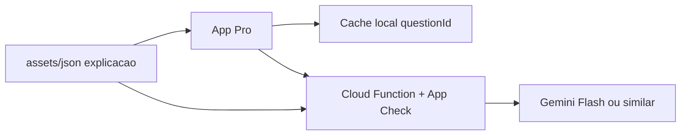

# IA no Habilitação Quiz+

**Épico:** [IA]  
**Onda:** 4 (após revisão de erros + estatísticas)

## Princípios

- Apoio de estudo; **não** substitui DETRAN/SENATRAN.
- Gabarito do JSON é soberano; IA **explica**, não contradiz.
- Legislação: citar só referências no contexto (`referencia_ctb` no JSON).
- **Zero IA no Free** no lançamento (custo previsível; degustação via tela **+** e explicações estáticas).

## Casos de uso (MoSCoW)

| Prioridade | Uso |
| :---: | :--- |
| **M** | Explicar erro em PT claro (Pro, online) |
| **M** | Fallback offline: campo `explicacao` no JSON |
| **S** | Coach “O que estudar hoje?” (regras + % por tema) |
| **S** | Plano semanal leve (template + LLM opcional) |
| **C** | Resumo pós-simulado |
| **W** | Chat livre CNH; modelo 100% on-device grande |

## Arquitetura (MVP)

- **Não** embutir API key no APK.
- Cotas Pro: ex. 30 explicações/dia, 300/mês; cache ilimitado local.

## Free vs Pro

| Recurso | Free | Pro |
| :--- | :---: | :---: |
| `explicacao` estática no JSON | ✅ | ✅ |
| Botão “Explicar com IA” | ❌ | ✅ |
| Coach inteligente | CTA | ✅ |

## Pré-requisitos

- P05 revisão erros, P04 stats por matéria, `ProGate`, binário **+** publicado
- HQ-I01 schema `id`, `explicacao`, `referencia_ctb` no JSON

## Tarefas HQ-I01 … HQ-I16

Ver [A_FAZER.md](../tasks/A_FAZER.md#ia--hq-i).

## Métricas

- ≥ 40% Pro usam ≥ 1 explicação IA na 1ª semana
- ≥ 70% thumbs up (amostra 50+)
- < 2% falha API após estabilização
- Monitorar custo cloud (cotas + cache)
