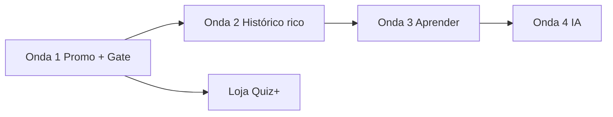

# Roadmap — Habilitação Quiz

**Atualizado:** 26 jul 2026

## Visão em ondas



| Onda | Nome | Entrega principal | Doc |
| :---: | :--- | :--- | :--- |
| **1** | Fundação + funil | ProGate, flavors, promo **+** no lugar do AdMob, limites 15q/1 sim/dia | [promocao](../features/promocao-quiz-plus.md), [modelo](../features/modelo-free-pro.md) |
| **2** | Histórico Pro | Ilimitado no **+**, filtros, detalhe simulado, export/backup | [historico](../features/historico-simulados.md) |
| **3** | Aprendizado | Aba Aprender, trilhas, fichas, modo prova, revisão erros | [area-aprendizado](../features/area-aprendizado.md) |
| **4** | IA | Explicar erro + coach (Pro) | [ia-pro](../features/ia-pro.md) |

## Fases de implementação

| Fase | Objetivo | Critério de pronto |
| :--- | :--- | :--- |
| **0** | Baseline documentado | Plano + tarefas aprovados |
| **1** | `kIsPro` + flavors + `ProGate` + testes | Dois AABs compilam |
| **2** | Onda 1 em produção (Free) | Sem AdMob; limites QA ok |
| **3** | Publicar **Habilitação Quiz+** | Ficha paga + `isProPublished` |
| **4** | Ondas 2–4 incrementais | Por épico, critérios em cada feature doc |

## Marcos sugeridos (indicativo)

| Marco | Conteúdo |
| :--- | :--- |
| **M1** | Semana 1–2: GATE + PROMO (HQ-P, T02–T14) |
| **M2** | Semana 3: Smoke Free/Pro + STORE interno |
| **M3** | Semana 4–6: Play **+** em review |
| **M4** | +4–8 sem: Onda 2 histórico rico |
| **M5** | +6–10 sem: Onda 3 Aprender MVP |
| **M6** | +10–16 sem: Onda 4 IA MVP |

Ajustar conforme disponibilidade (dev solo).

## Dependências críticas

```
app_edition + ProGate
    → limites quiz/simulado/histórico Pro
    → promo + (só Free)
    → flavors + STORE
        → histórico rico (precisa Pro publicado)
            → mapa competências + coach IA
```

## Métricas por onda

| Onda | Métrica |
| :--- | :--- |
| 1 | Clique promo → loja; crash-free; retenção D7 |
| 2 | % Pro que abre detalhe simulado |
| 3 | % que completa passo trilha |
| 4 | Uso explicação IA + thumbs up |

Ver [PRODUCT_PLAN.md](../product/PRODUCT_PLAN.md) §10.
