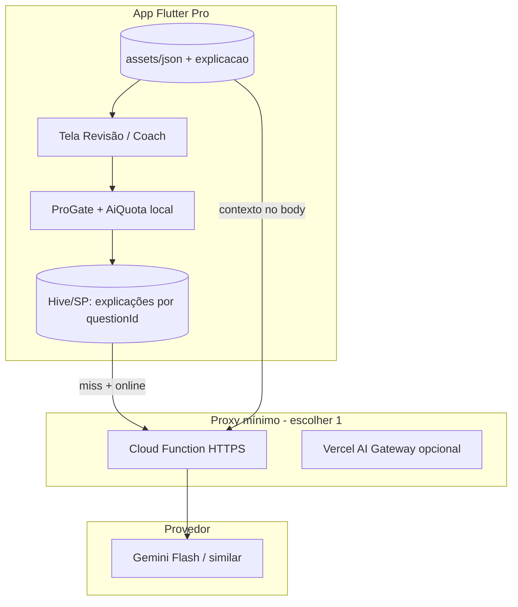

# IA no Habilitação Quiz+ — Plano de recurso (Pro)

**Data:** 26 de julho de 2026  
**Versão:** 0.1 (rascunho)  
**Status:** Proposta para fase pós-MVP do **+** (após P01–P04 e gate Free/Pro estáveis)  
**Público:** dev solo + alinhamento com [PRODUCT_PLAN.md](./PRODUCT_PLAN.md)

---

## 1. Princípios

### 1.1 Segurança e confiança

| Princípio | Implicação prática |
| :--- | :--- |
| **Não substituir o DETRAN/SENATRAN** | IA é *apoio de estudo*, não fonte oficial de aprovação, agendamento ou legislação “vigente em tempo real”. |
| **Disclaimer visível** | Antes do primeiro uso de IA e no rodapé de cada resposta: texto curto + link para aviso legal já existente (`legal_notice_screen.dart`). |
| **Sem alucinação em fatos legais** | Respostas sobre legislação devem **priorizar** explicação curada no JSON (`explicacao`, `referencia_ctb`) ou trechos pré-indexados; LLM só *reformula* texto ancorado, não inventa artigo. |
| **Citar fontes** | Quando o tema for legislação: exibir referência explícita (ex.: “CTB, art. X” ou “Resolução CONTRAN nº …”) vinda do banco ou de um catálogo local `assets/json/ctb_refs.json` — nunca só “o modelo disse”. |
| **Gabarito soberano** | A alternativa marcada `correta: true` no JSON continua sendo a verdade do app; IA explica *por que* a correta faz sentido e *por que* as outras não, sem contradizer o gabarito. |
| **Moderação de prompt** | Bloquear envio de PII (CPF, placa, nome completo); não pedir dados sensíveis; não armazenar conversas na nuvem além do mínimo técnico (ver privacidade). |

### 1.2 Privacidade

- **Padrão:** enviar à API apenas o necessário: ID estável da questão (hash do enunciado + tema), enunciado, alternativas, índice da escolhida do usuário, gabarito — **sem** identificador de conta (app não tem login hoje).
- **Opt-in explícito** para “melhorar explicações” (telemetria agregada de thumbs up/down) — desligado por padrão.
- **Política de retenção:** se usar proxy (Cloud Function), logs com TTL ≤ 7 dias; sem treinar modelo com dados de usuários sem consentimento separado.
- **Transparência na ficha da loja:** atualizar Data safety / Privacy Nutrition Label quando houver chamada de rede para IA.

### 1.3 Experiência offline

- **Tier 0 (sempre offline):** explicações estáticas no JSON (P09 do plano principal) + mensagem “Sem conexão — veja a explicação do app” quando existir.
- **Tier 1 (online, Pro):** explicação personalizada via LLM.
- **Degradação graciosa:** fila local opcional só se no futuro houver backend; no MVP, botão desabilitado + CTA “Conecte-se à internet”.

### 1.4 Custo e sustentabilidade (solo dev)

- IA **somente no binário Pro** (compra única) — custo variável absorvido com **cotas por dispositivo** e modelos baratos.
- Evitar assinatura só por IA até haver receita recorrente ou patrocínio; revisar preço do **+** se cotas forem generosas.

---

## 2. Casos de uso priorizados (MoSCoW)

Legenda: **M** = Must (MVP IA), **S** = Should (fase 2), **C** = Could (fase 3), **W** = Won’t (agora).

| Prioridade | Caso de uso | Descrição | Dependências |
| :---: | :--- | :--- | :--- |
| **M** | **Explicar erro em PT claro** | Após errar (ou na revisão P05), botão “Entender com IA” gera 3–6 frases: por que a correta está certa, erro comum na alternativa escolhida, dica mnemônica. | JSON com `id` por pergunta; tela de resultado/revisão; rede |
| **M** | **Fallback sem IA** | Mesmo fluxo mostra `explicacao` do JSON ou texto genérico por tema se offline, cota esgotada ou erro de API. | P09 conteúdo mínimo nas questões mais erradas |
| **S** | **Coach: “O que estudar hoje?”** | Card na Home (Pro): 1 simulado curto OU 1 quiz tema sugerido com base em **% por matéria** (P04) e recência; copy gerada por template + opcional 1 parágrafo LLM. | Estatísticas por tema; persistência além de `HistoricoEntity` agregado |
| **S** | **Plano semanal leve** | “Seg–Dom: foco Legislação + 1 simulado” — regras locais 80% + LLM só para tom motivacional (baixo risco). | Coach M/S acima |
| **C** | **Resumo da sessão** | Após simulado: “Você errou 4 em Direção defensiva — revise sinais do agente”. Template + lista de IDs para revisão. | Persistir IDs das questões erradas por sessão |
| **C** | **Simulado oral (estilo banca)** | Pergunta aberta + avaliação da resposta do usuário (STT + LLM). Alto risco de alucinação e custo. | STT, UX dedicada, revisão jurídica |
| **W** | Chat livre “tire dúvidas de CNH” | Escopo infinito, custo e responsabilidade legal altos. | — |
| **W** | Modelo 100% on-device grande | APK pesado, manutenção de weights, qualidade inferior em PT jurídico. | — |

### 2.1 MVP IA (escopo fechado)

1. Um botão **“Explicar resposta”** na revisão do último teste (Pro, online).
2. Cotas e cache local de explicações já geradas (por `questionId`).
3. Prompt com **RAG leve**: injetar `referencia_ctb` + `explicacao` curada quando existir; instrução rígida de não citar artigos não presentes no contexto.
4. Telemetria mínima: contagem de chamadas, taxa de erro API, thumbs up/down (local → opcional Firebase Analytics event).

### 2.2 Fase 2 — Coach

1. Estender histórico para salvar **erros por questão** (ou por hash) nas últimas N sessões — hoje `ResultadoEntity` só guarda totais por `titulo`.
2. Regra determinística: ordenar temas por menor % acerto nos últimos 7 dias.
3. LLM opcional só para redigir o parágrafo “Seu foco hoje é…”.

### 2.3 Fase 3 — Oral (exploratório)

- Protótipo interno; não prometer na ficha da loja até validação com 5–10 usuários beta e checklist jurídico.

---

## 3. Arquitetura sugerida (alto nível)

### 3.1 Estado atual

- Flutter, questões em `assets/json/*.json`, histórico em `SharedPreferences`, **sem backend**.
- Cinco eixos: Legislação, Direção defensiva, Mecânica, Primeiros socorros, Meio ambiente (~200 questões).

### 3.2 Opções avaliadas

| Abordagem | Prós | Contras | Veredito |
| :--- | :--- | :--- | :--- |
| **A. On-device (Gemini Nano / llama.cpp)** | Privacidade, sem servidor | Qualidade jurídica, tamanho do app, manutenção | **Fase 3+** ou explicações *muito* curtas |
| **B. App → API direta (chave no app)** | Simples | Chave vazada, abuso, custo | **Não** |
| **C. App → proxy mínimo → LLM** | Chave no servidor, cotas, prompt fixo | Um serviço para operar | **Recomendado MVP** |
| **D. Firebase AI Logic / Vertex no cliente** | SDK oficial, billing Google | Ainda expõe config; regras de cota no app são frágeis | **Possível** se usar **App Check** + Cloud Function wrapper |

### 3.3 Arquitetura recomendada (solo dev, pragmática)

**Fluxo “Explicar erro”:**

1. App monta payload estruturado (`questionId`, `tema`, `enunciado`, `alternativas[]`, `indiceUsuario`, `indiceCorreto`, `explicacaoCurada?`, `referenciaCtb?`).
2. Proxy valida: App Check ou token assinado de uso (HMAC com segredo rotacionável), rate limit por `installationId` (UUID gerado no primeiro uso, só local).
3. Proxy monta prompt sistema (fixo, versionado `prompt_v1.txt` no repo do function) e chama modelo **barato** (ex.: Gemini 2.x Flash).
4. Resposta JSON `{ "texto": "...", "fontes": ["CTB art. ..."] }` — `fontes` só ecoa o que veio do contexto; proxy rejeita se modelo inventar artigo não listado (validação simples por allowlist).
5. App grava em cache; exibe com disclaimer.

**Firebase AI Logic:** útil se o projeto já estiver no Firebase (Analytics/Crashlytics futuro). Mesmo assim, **não** chamar o modelo com API key embutida no APK — usar Callable Function ou HTTP function com Firebase App Check.

**Vercel AI Gateway:** alternativa se preferir um único painel de rotas/failover e já usar Vercel para landing/docs; a function pode ser uma Edge Function mínima. Não é obrigatório no dia 1.

### 3.4 Conteúdo e anti-alucinação

| Camada | Função |
| :--- | :--- |
| **JSON curado** | Campo opcional `explicacao`, `referencia_ctb`, `tags[]` por pergunta |
| **Catálogo CTB** | Arquivo local com trechos curtos e IDs — só estes IDs podem aparecer em `fontes` |
| **Prompt** | “Use apenas referências fornecidas em `allowed_refs`; se vazio, diga que a explicação é didática e indique CTB genérico sem número de artigo” |
| **Pós-processamento** | Regex/allowlist no proxy; truncar resposta > 800 caracteres |

### 3.5 Evolução do histórico (para Coach)

- Novo modelo `SessaoDetalhada` em `SharedPreferences`: `{ data, tipo, tema, erros: [questionId] }`.
- Migração não destrutiva; Pro-only na escrita detalhada (Free mantém agregado atual).

---

## 4. Free vs Pro (IA)

| Recurso | Habilitação Quiz (Free) | Habilitação Quiz+ (Pro) |
| :--- | :---: | :---: |
| Explicações estáticas no JSON (P09) | ✅ Leitura nas questões que tiverem campo | ✅ |
| Botão “Explicar com IA” | ❌ **Recomendado: zero IA** (evita custo e suporte) | ✅ Com cota |
| Coach “O que estudar hoje” | ❌ (pode mostrar CTA: “No **+**, plano de estudo inteligente”) | ✅ Fase 2 |
| Simulado oral IA | ❌ | ❌ até fase 3 |

### 4.1 Teaser Free — decisão recomendada

| Opção | Prós | Contras |
| :--- | :--- | :--- |
| **3 explicações IA/mês no Free** | Degustação, funil | Chave/proxy abuso, suporte “não funciona”, complexidade de cota cross-app |
| **Zero IA no Free (recomendado)** | Custo previsível, Pro claro, menos fraude | Menos “wow” na degustação |

**Recomendação:** **zero IA no Free** no lançamento; degustação via **vídeo/GIF na tela Habilitação Quiz+** e 1–2 explicações estáticas de alta qualidade no Free. Reavaliar teaser com 3/mês só se conversão Free→**+** < 2% após 6 meses **e** proxy com App Check maduro.

### 4.2 Cotas Pro (dispositivo)

| Limite | Valor sugerido MVP | Observação |
| :--- | :--- | :--- |
| Explicações IA / dia | 30 | Cobre sessão intensiva; impede scraping |
| Explicações IA / mês | 300 | ~10/dia média; suficiente até a prova |
| Coach LLM / dia | 3 | Resto é template determinístico |
| Cache | Ilimitado local | Mesma questão não reconta cota |

Usuário que esgotar: mensagem clara + explicação estática se houver.

---

## 5. Tarefas (HQ-I…)

Prefixo **HQ-I** = Habilitação Quiz — Inteligência. Ordem sugerida para dev solo.

| ID | Tarefa | Fase | Esforço |
| :--- | :--- | :---: | :---: |
| **HQ-I01** | Especificar schema JSON: `id`, `explicacao`, `referencia_ctb`, `tags` (retrocompatível) | Pré-MVP IA | P |
| **HQ-I02** | Curar explicações nas ~40 questões mais difíceis (Legislação + Direção defensiva) | Pré-MVP IA | M |
| **HQ-I03** | `AiQuotaService` local (SP/Hive) + integração `ProGate` (`kIsPro` only) | MVP IA | P |
| **HQ-I04** | UI: botão “Explicar resposta” na revisão P05 + estados loading/erro/offline | MVP IA | M |
| **HQ-I05** | Disclaimer + tela “Como funciona a IA” (1ª vez) | MVP IA | P |
| **HQ-I06** | Proxy HTTPS (Cloud Function): auth App Check, rate limit, prompt `v1`, logs TTL | MVP IA | M |
| **HQ-I07** | Cliente Dart: `ExplainAnswerRepository`, cache por `questionId`, testes unitários | MVP IA | M |
| **HQ-I08** | Validação `fontes` no proxy (allowlist) + testes de contrato JSON | MVP IA | P |
| **HQ-I09** | Analytics: `ai_explain_requested`, `ai_explain_failed`, `ai_thumb_up/down` | MVP IA | P |
| **HQ-I10** | Atualizar política de privacidade / Data safety (dados enviados à IA) | MVP IA | P |
| **HQ-I11** | Persistir erros por questão em sessões Pro (`SessaoDetalhada`) | Coach | M |
| **HQ-I12** | `StudyCoachService` determinístico (% por tema, últimos 7 dias) | Coach | M |
| **HQ-I13** | Card Home “O que estudar hoje” + deep link para quiz/simulado sugerido | Coach | M |
| **HQ-I14** | Parágrafo opcional LLM no coach (prompt baixo risco, cota 3/dia) | Coach | P |
| **HQ-I15** | Spike: STT + fluxo oral em branch experimental (sem release) | Oral | G |
| **HQ-I16** | Revisão jurídica copy disclaimer + 20 respostas IA amostrais | Qualidade | P |

*Esforço: P = pequeno (≤2 dias), M = médio (3–7 dias), G = grande (exploração).*

**Pré-requisitos de produto:** P05 revisão de erros, P04 estatísticas por matéria, binário **+** publicado, `ProGate` estável.

---

## 6. Métricas e custos (qualitativos)

### 6.1 Métricas de produto

| Métrica | Meta / uso |
| :--- | :--- |
| **Adoção IA (Pro)** | ≥ 40% dos Pro ativos usam ≥ 1 explicação IA na primeira semana |
| **Utilidade** | ≥ 70% thumbs up nas explicações IA (amostra mínima 50 votos) |
| **Conversão** | Comparar instalação **+** antes/depois do marketing “Explicações com IA” |
| **Retenção D7 Pro** | +2 pp vs baseline sem IA (hipótese a validar) |
| **Erro técnico** | < 2% chamadas com falha 5xx/timeout após estabilização |
| **Coach (fase 2)** | ≥ 25% Pro abre card “O que estudar hoje” ≥ 3×/semana |

### 6.2 Métricas de custo operacional

| Driver | Ordem de magnitude (solo dev) |
| :--- | :--- |
| **Custo por explicação** | Modelo Flash: frações de centavo USD por chamada (centenas de tokens) |
| **100 usuários Pro ativos/mês**, 50 explicações/mês cada | Dezenas de USD/mês se sem cache — **cache por questão** reduz ~30–50% |
| **1000 usuários Pro** | Centenas de USD/mês — exige cotas rígidas + modelo barato; monitorar dashboard Google Cloud |
| **Proxy / Functions** | Camada gratuita cobre MVP; atenção a cold start e região `southamerica-east1` |
| **Tempo de manutenção** | ~0,5–1 dia/mês (logs, ajuste de prompt, revisão de reclamações) |

### 6.3 Riscos

| Risco | Mitigação |
| :--- | :--- |
| Resposta juridicamente imprecisa | RAG + allowlist + disclaimer; priorizar JSON curado |
| Abuso do proxy | App Check, rate limit, sem chave no app |
| Custo explosivo | Cotas dispositivo, cache, alerta de billing |
| Review da loja (medical/education claims) | Copy modesto: “apoio ao estudo”, não “garantia de aprovação” |
| Escopo creep (chat livre) | MoSCoW Won’t até receita sustentar moderação |

---

## 7. Roadmap resumido

| Fase | Entrega IA | Quando (indicativo) |
| :--- | :--- | :--- |
| **IA-0** | HQ-I01, I02, conteúdo estático P09 | Paralelo à Fase 3 do plano principal |
| **IA-1 (MVP)** | HQ-I03–I10: explicar erro Pro + proxy | 4–6 semanas após **+** estável |
| **IA-2** | HQ-I11–I14: coach determinístico + LLM leve | +4 semanas |
| **IA-3** | HQ-I15–I16: oral experimental | Sem compromisso de loja |

---

## 8. Referências internas

- [PRODUCT_PLAN.md](./PRODUCT_PLAN.md) — P04, P05, P09, matriz Free vs Pro  
- Questões: `assets/json/*.json`  
- Histórico atual: `lib/app/features/historico/`, `ResultadoEntity` (agregado por tema)  
- Aviso legal: `legal_notice_screen.dart`
