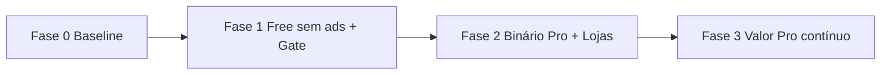

# Plano de Produto — Habilitação Quiz

**Data:** 26 de julho de 2026  
**Versão:** 1.1  
**Status:** App em produção (v1.9.x) com AdMob → transição para **promo do Habilitação Quiz+** (sem rede de ads) + app pago **+**  
**Docs:** [Índice](../README.md) · [Features](../features/README.md) · [Planejamento](../planning/README.md) · [Tarefas](../tasks/A_FAZER.md) · [Store](../store/README.md)  
**Referência de modelo:** projeto irmão **Cura.li** (paths no monorepo local, se disponível: `cura.li/docs/product/PRODUCT_PLAN.md`)

---

## 1. Objetivo

Definir:

1. **Situação atual** do app e o que muda na estratégia comercial
2. **Modelo Free + Habilitação Quiz+** (dois apps, mesmo código)
3. **Matriz de recursos** (o que fica grátis vs pago)
4. **Pontos de evolução** (produto e técnica)
5. **Link Free → Pago** (onde, como e copy)
6. **Roadmap** e critérios de pronto

**Princípio educacional:** o Free deve ser **útil de verdade** para quem está começando a estudar; o **+** deve valer para quem vai fazer a prova em breve e precisa de simulado completo, revisão e acompanhamento.

---

## 2. Situação atual (baseline técnico)

Inventário a partir do código em `lib/` e dos bancos em `assets/json/` (jul/2026).

### 2.1 O que já existe

| Área | Detalhe |
| :--- | :--- |
| **Arquitetura** | Clean Architecture + GetX (rotas, DI, estado) |
| **Quizzes por tema** | Legislação (56), Direção defensiva (38), Mecânica (36), Primeiros socorros (37), Meio ambiente (36) |
| **Simulado** | 30 questões, proporção próxima da prova (`lib/app/shared/utils/simulado.dart`) |
| **Aprovação** | ≥ 70% (`mediaQuiz` em `constants.dart`) |
| **Histórico** | `SharedPreferences`; **máx. 10 resultados** (FIFO em `HistoricoEntity.add()` — remove o mais antigo ao salvar o 11º) |
| **Resultado** | Compartilhar texto via `share_plus` |
| **Legal** | Tela de aviso + links SENATRAN / CTB (`legal_notice_screen.dart`) |
| **Monetização atual** | `google_mobile_ads` — banner na Home (slot no topo dos quizzes); código AdMob no Histórico sem uso no layout |
| **Monetização alvo** | Slots de UI promovendo **Habilitação Quiz+** (ver [promocao-quiz-plus.md](../features/promocao-quiz-plus.md)) |
| **ID Android** | `br.com.sthaynny.habilitacao_quiz` |
| **Testes** | Unitários em repositórios, use cases e models |

### 2.2 Lacunas para o novo modelo

| Lacuna | Impacto |
| :--- | :--- |
| Sem `kIsPro` / flavors Free vs Pro | Um único binário; não dá para vender **+** separado |
| Sem `ProGate` no domínio | Limites só na UI seriam fáceis de contornar |
| AdMob de terceiros | Substituir por promo do app **+**; atualizar Data safety |
| Cap 10 no histórico para todos | Pro precisa **ilimitado** via `ProGate`; Free mantém 10 |
| Sem modo prova / revisão de erros | Diferenciais naturais do plano pago ainda não existem |
| Sem tela / constantes de loja Pro | Não há funil Free → Pago estruturado |

---

## 3. Proposta de valor

| Para quem | Dor | Solução Free | Solução **+** |
| :--- | :--- | :--- | :--- |
| Primeira CNH | Não sabe por onde começar | Quizzes por tema, amostra de questões, 1 simulado reduzido | Banco completo + simulados ilimitados no formato da prova |
| Quem vai marcar a prova | Medo de errar por tempo / tema fraco | Histórico recente e share básico | Histórico completo, gráficos por matéria, revisão do que errou |
| Quem odeia app cheio de anúncio | Distração na hora de estudar | **Sem rede de ads**; promo honesta do **+** nos mesmos slots | Experiência focada + ferramentas de preparação intensiva |

**Diferencial vs concorrentes genéricos:** conteúdo em PT-BR alinhado aos eixos da prova teórica, simulado com 30 questões e proporção por matéria, disclaimer legal explícito (já no app).

---

## 4. Modelo comercial: dois apps (como Cura.li)

### 4.1 Decisão

| Abordagem | Prós | Contras |
| :--- | :--- | :--- |
| Freemium + IAP in-app | Uma listagem | Receipts, restaurar compras, mais complexidade |
| **Dois apps (Free + Pro) — recomendado** | Preço claro na loja; Pro desbloqueado no binário; sem IAP no MVP | Duas fichas, reviews separadas; flavors + IDs distintos |

**Decisão:** publicar **Habilitação Quiz** (grátis, limites, **promo do +** no lugar do AdMob) e **Habilitação Quiz+** (pago na loja). Mesmo repositório; `--dart-define` + flavors Android/iOS.

> **Lojas:** Apple e Google desencorajam apps quase idênticos. Diferenciar nome (**Habilitação Quiz+**), ícone com “+”, descrição focada em simulado completo e analytics de estudo.

### 4.2 Identidade Free vs Pro

| Campo | Habilitação Quiz (Free) | Habilitação Quiz+ (Pro) |
| :--- | :--- | :--- |
| Nome na loja / launcher | **Habilitação Quiz** | **Habilitação Quiz+** |
| Application ID (Android) | `br.com.sthaynny.habilitacao_quiz` | `br.com.sthaynny.habilitacao_quiz.pro` |
| Bundle ID (iOS) | `br.com.sthaynny.habilitacao_quiz` | `br.com.sthaynny.habilitacao_quiz.pro` |
| Preço | Grátis | Compra única (sugestão abaixo) |
| Rede de anúncios (AdMob) | **Nenhuma** | **Nenhuma** |
| Promo **Habilitação Quiz+** (banners/CTAs) | ✅ Home, Histórico, limites | ❌ |
| Flag de build | `HABILITACAO_QUIZ_PRO=false` (default) | `HABILITACAO_QUIZ_PRO=true` |

### 4.3 Preço inicial sugerido (BR)

| Opção | Faixa | Observação |
| :--- | :--- | :--- |
| Compra única **Habilitação Quiz+** | R$ 19,90 – R$ 34,90 | Abaixo de muitos “pacotes CNH”; ajustar após beta |
| Assinatura | Fase 2 (opcional) | Só se houver conteúdo contínuo (novos simulados mensais, etc.) |

O Free funciona como **degustação honesta**; não há trial in-app no MVP.

---

## 5. Matriz de recursos (Free vs Pro)

Valores sugeridos para MVP — revisar após feedback de usuários.

| Recurso | Free | Habilitação Quiz+ |
| :--- | :---: | :---: |
| Promo do app **+** (substitui AdMob) | ✅ | ❌ |
| Rede de anúncios terceiros | ❌ | ❌ |
| Quizzes por tema (5 matérias) | ✅ Até **15 questões** por sessão (aleatórias do banco) | ✅ **Todas** as questões do tema, sessões ilimitadas |
| Simulado | ✅ **1 simulado / dia**, **15 questões** (metade da prova) | ✅ Simulado **30 questões**, proporção oficial, **ilimitado** |
| Critério de aprovação (70%) | ✅ | ✅ |
| Histórico de resultados | ✅ Últimos **10** (já implementado) | ✅ Ilimitado + detalhe simulado (Onda 2) |
| Área **Aprender** (trilhas, resumos) | ✅ Básica | ✅ Completa + fichas + mapa |
| IA (explicar erro, coach) | ❌ | ✅ Onda 4 |
| Estatísticas por matéria | ❌ | ✅ % acerto por tema, evolução |
| Revisar questões erradas (último quiz) | ❌ | ✅ Gabarito comentado (quando houver explicação no JSON) |
| Modo prova (cronômetro ~40 min) | ❌ | ✅ |
| Compartilhar resultado (texto) | ✅ | ✅ |
| Exportar histórico (PDF/CSV) | ❌ | ✅ Fase 1.1 |
| Backup / restaurar histórico (arquivo local) | ❌ | ✅ Fase 1.1 |
| Tema escuro | ✅ (manter em ambos se já existir ou for trivial) | ✅ |
| Aviso legal + fontes oficiais | ✅ | ✅ |
| Paywall / compra in-app | ❌ — só CTA para loja do **+** | Não se aplica |

### 5.1 Regras de produto (importantes)

1. **Nunca apagar** histórico já salvo no Free ao “atingir limite”; só impedir **novos** registros além do teto (ou consolidar os mais antigos com aviso — preferir bloquear novo save e pedir upgrade).
2. **Nunca bloquear** um simulado **em andamento**; limite diário vale para **iniciar** novo simulado.
3. Limites aplicados no **domínio** (`ProGate`), não só escondendo botões.
4. Mensagens de limite sempre com **próximo passo**: “Conhecer Habilitação Quiz+” ou “Ver na loja”.

---

## 6. Link Free → Pago (funil)

Espelha o padrão Cura.li: `AppStoreConstants`, banner `HabilitacaoQuizPlusCtaBanner`, rota `/habilitacao-quiz-plus`.

### 6.1 Pontos de contato (UI)

| Momento | Comportamento Free | CTA |
| :--- | :--- | :--- |
| **Home** — topo ou abaixo do título | Banner discreto: “Simulado completo e sem limites no **+**” | Abre tela Habilitação Quiz+ |
| **Card Simulado** | Se limite diário atingido: card com cadeado + texto do limite | Mesma tela **+** |
| **Ao iniciar quiz tema** | Se quiser sessão > 15 questões (futuro botão “estudo completo”) | **+** |
| **Histórico** — 11º resultado | Snackbar + tile fixo “Desbloquear histórico completo” | **+** |
| **Tela de resultado** — simulado Free 15q | Linha: “No **+**, simulado de 30 questões como na prova” | **+** |
| **App bar / menu** (se houver Configurações ou Legal) | Item “Habilitação Quiz+” | **+** |
| **Empty state histórico** | Sem CTA agressivo; foco em “faça um quiz” | Opcional link pequeno no rodapé |

### 6.2 Tela Habilitação Quiz+

Conteúdo mínimo (sem dark patterns):

- 3–5 benefícios com ícone (simulado 30q, histórico ilimitado, revisão, modo prova, estatísticas)
- Texto: compra única na loja; **sem** assinatura no MVP; **sem** “restaurar compras” (app pago separado)
- Botão primário: `Ver na Google Play` / `Ver na App Store` (conforme plataforma)
- Enquanto Pro não publicado: `isProPublished = false` → label “Em breve” + mensagem amigável (igual Cura.li)
- Botão fechar sempre visível

### 6.3 Constantes de loja (a criar)

Arquivo sugerido: `lib/core/constants/app_store_constants.dart`

```dart
abstract final class AppStoreConstants {
  static const bool isProPublished = false; // true após publicar o +
  static const String playStoreProUrl =
      'https://play.google.com/store/apps/details?id=br.com.sthaynny.habilitacao_quiz.pro';
  static const String appStoreProUrl =
      'https://apps.apple.com/app/idPLACEHOLDER';
  static const String ctaLabel = 'Conhecer Habilitação Quiz+';
  static const String ctaHint =
      'Simulados completos, histórico ilimitado e modo prova no app pago.';
}
```

### 6.4 Deep link e campanha (opcional)

- UTM na URL da Play Store para medir origem (`utm_source=app_free&utm_medium=cta_home`)
- Na ficha do **Free**, mencionar o **+** na descrição longa (sem exigir instalação dupla)

---

## 7. Implementação técnica (alinhada ao Cura.li)

### 7.1 Compile-time

| Item | Detalhe |
| :--- | :--- |
| Flag | `HABILITACAO_QUIZ_PRO` → `bool.fromEnvironment(..., defaultValue: false)` |
| Nomes | `AppEditionNames.free` / `.pro` |
| Builds | `flutter build appbundle` (Free) vs `--dart-define=HABILITACAO_QUIZ_PRO=true` + flavor `pro` |

### 7.2 ProGate (domínio)

Serviço sugerido: `lib/app/shared/domain/services/pro_gate.dart` (ou `lib/core/`)

| Método / propriedade | Uso |
| :--- | :--- |
| `isPro` | Build Pro ou stub em testes |
| `maxQuestoesPorSessaoTema` | 15 Free / `null` (= ilimitado) Pro |
| `maxQuestoesSimulado` | 15 Free / 30 Pro |
| `maxSimuladosPorDia` | 1 Free / `null` Pro |
| `maxResultadosHistorico` | 10 Free / `null` Pro |
| `podeIniciarSimuladoHoje(contagemHoje)` | Free |
| `podeSalvarResultado(quantidadeAtual)` | Free |

Implementação MVP: `CompileTimeProGate` lendo `kIsPro` (como `CompileTimeProGate` no Cura.li).

### 7.3 Remoção de anúncios no Free

| Passo | Arquivo / ação |
| :--- | :--- |
| Remover init AdMob do `main.dart` no Free | Condicional `if (!kIsPro)` → na prática **remover de ambos**; Pro também sem ads |
| Remover `BannerAd` de `home_screen.dart` e `historico_widget.dart` | Substituir `bottomAd` por `SizedBox.shrink()` ou banner CTA **+** só no Free |
| `pubspec.yaml` | Remover `google_mobile_ads` quando código morto for eliminado |
| Play Console | Atualizar Data safety (sem dados de ads) |

### 7.4 Ajustes de use cases

| Use case | Mudança |
| :--- | :--- |
| `*QuizUsercase` | Após carregar JSON, `take(n)` conforme `ProGate` + shuffle |
| `SimuladoQuizUsercase` / `Simulado` | Parametrizar contagens (15 vs 30) e proporção |
| `SalvarHistoricoUsecase` | Recusar ou truncar com aviso conforme gate |
| Novo (Pro) | Persistir contagem de simulados do dia (`SharedPreferences`) |

### 7.5 Android flavors

Seguir `cura.li/android/app/build.gradle.kts`: flavors `free` e `pro`, `applicationIdSuffix` ou ID `.pro`, `resValue` para `app_name`.

### 7.6 iOS

Scheme + Bundle ID `.pro`, display name **Habilitação Quiz+** (documentar em `docs/store/BUILD.md` quando existir).

---

## 8. O que colocar no plano pago (backlog de valor)

Priorizado por impacto na preparação para a prova.

### 8.1 MVP Pro (junto com o lançamento do **+**)

| ID | Feature | Por que paga |
| :--- | :--- | :--- |
| P01 | Simulado 30 questões ilimitado | Espelha a prova real |
| P02 | Quizzes com banco completo por tema | Volume de estudo |
| P03 | Histórico ilimitado + lista completa | Acompanhar evolução |
| P04 | Estatísticas simples por matéria | Onde estudar mais |

### 8.2 Pós-lançamento (diferenciação contínua)

| ID | Feature | Plano |
| :--- | :--- | :--- |
| P05 | Revisão das erradas do último teste | Pro |
| P06 | Modo prova com cronômetro | Pro |
| P07 | Export PDF/CSV do histórico | Pro |
| P08 | Backup/restauração local do histórico | Pro |
| P09 | Explicações nas questões (expandir JSON) | Pro (conteúdo) |
| P10 | Novos simulados (variantes B, C…) | Pro primeiro; depois alguns no Free |
| P11 | Flashcards de placas | Pro ou pacote futuro |
| P12 | Widget “questão do dia” | Free teaser → **+** para arquivo |

### 8.3 Evolução do Free (retenção, sem ads)

| ID | Feature | Objetivo |
| :--- | :--- | :--- |
| F01 | Onboarding “escolha sua matéria fraca” | Ativação D1 |
| F02 | Lembrete local de estudo (notificação opcional) | Retenção |
| F03 | Melhor empty state no histórico | Clareza |
| F04 | Atualização periódica de questões (patch JSON) | Confiança no conteúdo |

---

## 9. Roadmap por fases



| Fase | Entrega | Critério de pronto |
| :--- | :--- | :--- |
| **0** | Documentação + métricas atuais | Este plano aprovado |
| **1** | Remover ads; `kIsPro` + `ProGate`; limites Free; CTAs | Testes unitários do gate; QA manual dos limites |
| **2** | Flavors, AAB/IPA Pro, fichas Play/App Store, `isProPublished=true` | 4 listagens ou 2 plataformas × 2 apps em review |
| **3** | P05–P08, conteúdo explicado, novos simulados | Uso beta: ≥30% dos Pro fazem 2+ simulados/semana |

### Checklist resumido (implementação)

- [ ] `app_edition.dart` + `HABILITACAO_QUIZ_PRO`
- [ ] `ProGate` + testes
- [ ] Limites em use cases (quiz, simulado, histórico)
- [ ] Remover `google_mobile_ads`
- [ ] `AppStoreConstants` + `HabilitacaoQuizPlusScreen` + banner CTA
- [ ] Flavors Android `free` / `pro`
- [ ] iOS Bundle ID Pro
- [ ] Textos de loja Free e Pro (`google_play/` + App Store)
- [ ] Atualizar Data safety / privacidade (sem ads)
- [ ] Smoke test dos dois AABs

---

## 10. Métricas de sucesso

| Métrica | Meta inicial (3 meses) |
| :--- | :--- |
| Retenção D7 (Free) | ≥ 20% |
| % que completa 1 quiz tema | ≥ 60% dos ativos |
| % que faz 1 simulado (mesmo 15q) | ≥ 35% |
| Conversão Free → instalação **+** | 2–4% (orgânico + CTA) |
| Avaliação loja Free | ≥ 4,2 (sem anúncios costuma ajudar) |
| Crash-free sessions | ≥ 99,5% |

---

## 11. Riscos e mitigação

| Risco | Mitigação |
| :--- | :--- |
| Lojas rejeitam apps duplicados | Ficha e ícone **+** distintos; Free com limites explícitos na descrição |
| Free “generoso demais” | Revisar limites (simulado 1/dia, 15q) após analytics |
| Free “pobre demais” | Manter 5 temas e simulado parcial utilizável |
| Perda de receita AdMob | Projetar preço **+** para compensar; destacar “sem anúncios” no marketing |
| Usuário compra **+** mas instalou Free | Copy claro: “app separado”; ícone diferente |

---

## 12. Migração da versão atual (com anúncios)

1. **Comunicar** na nota de versão: remoção de anúncios; limites no Free; opção **Habilitação Quiz+**.
2. **Não regredir** dados: histórico existente permanece; aplicar limite só em novos saves (ou grandfathering dos primeiros 30 dias — decisão de lançamento).
3. **Play Console:** nova declaração sem advertising ID se aplicável.

---

## 13. Conclusão

O caminho mais alinhado ao Cura.li e ao público de CNH:

1. **Free limpo** (sem anúncios), com estudo real mas limitado.  
2. **Habilitação Quiz+** como app pago com simulado completo e ferramentas de reta final.  
3. **Funil claro** da Home ao Histórico e ao Simulado, sempre com respeito ao estudante.  
4. **Evolução** focada em revisão de erros, modo prova e conteúdo explicado — valor que justifica o **+**.

---

## Referências

### Cura.li (monorepo local)

| Artefato | Path |
| :--- | :--- |
| PRODUCT_PLAN | `cura.li/docs/product/PRODUCT_PLAN.md` |
| ProGate | `cura.li/lib/domain/services/pro_gate.dart` |
| App edition | `cura.li/lib/core/constants/app_edition.dart` |
| App store constants | `cura.li/lib/core/constants/app_store_constants.dart` |

### Este repositório

- `lib/app/shared/utils/simulado.dart`
- `lib/core/utils/ad_helper.dart`
- `assets/json/*.json`
